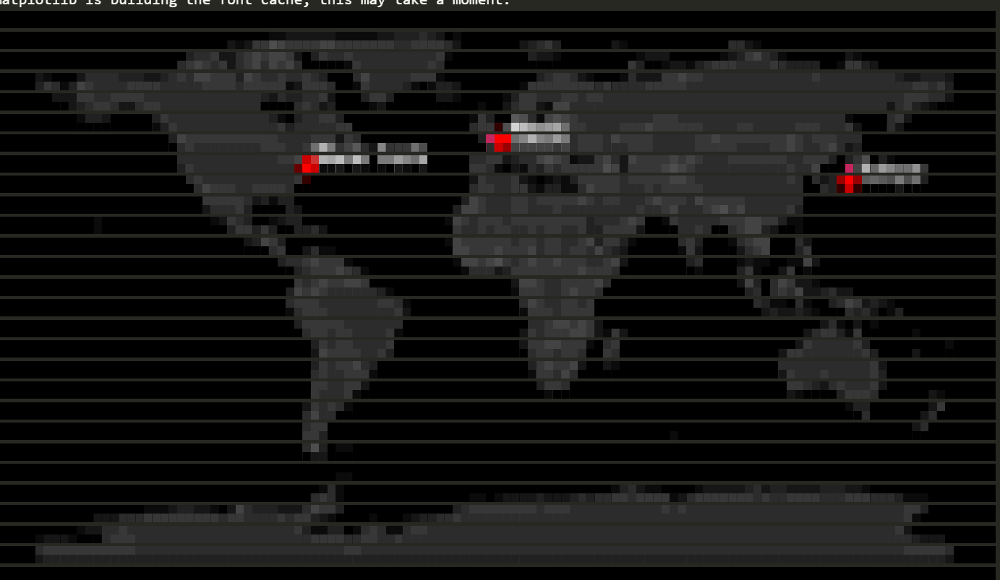
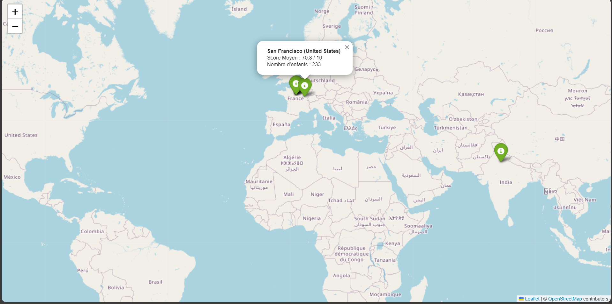

# 🎅 Santa's Nice List Tracker 2025 - Data & Geospatial Analysis

## À propos

Ce projet est une solution technique au challenge du jour 08. L'objectif est d'analyser une base de données d'enfants (`kids.db`) pour identifier les (top 3 des enfants avec le meilleur score de sagesse mais.. petit changement technique :p) régions géographiques ayant le meilleur "Score de Sagesse" moyen, et de visualiser ces données.

J'ai exploré plusieurs méthodes de visualisation, allant de la cartographie interactive classique à des rendus expérimentaux directement dans le terminal.

-----

## Fonctionnalités

  * **Extraction de données SQL** : Requêtes avec jointures (`JOIN`), agrégations (`GROUP BY`, `AVG`) et filtrage.
  * **Analyse Géospatiale** : Identification des clusters géographiques (Villes/Régions) les plus performants.
  * **Visualisation Multi-Formats** :
      * Cartes HTML interactives.
      * Rendu ASCII/ANSI directement dans la console.

-----

## L'Odyssée de la Visualisation (Méthodologie)

J'ai itéré sur quatre approches techniques distinctes pour afficher la carte du monde, du plus simple au plus "Hard".

### 1\. L'Approche Classique : Folium (HTML)

La méthode standard en Data Science. Je génère une carte interactive basée sur OpenStreetMap (merci jupyter notebook ;).

  * **Avantages** : Zoom, détails infinis, interactivité.
  * **Technique** : Utilisation de `folium` et `branca` pour générer un fichier `.html`.
  * **Documentation** : [Folium Docs](https://python-visualization.github.io/folium/)

### 2\. L'Approche  à la main...

*La tentative purement algorithmique.*
J'ai essayé (c'est peu dire...) de projeter moi-même les coordonnées Latitude/Longitude (sphériques) sur une grille 2D (l'écran) sans librairie graphique.

  * **Le défi** : Convertir `lat (-90/90)` et `lon (-180/180)` en coordonnées matricielles `x,y`.
  * **Résultat** : Fonctionnel mathématiquement, mais visuellement IMPOSSIBLE à interpréter sans les contours des continents 😂.
  * **Leçon** : La projection de Mercator est méga-giga-complexe à coder depuis la base sans distorsion.

### 3\. L'Approche Vectorielle : Plotext ++ Geopandas

Pour avoir des formes définies en console, j'ai couplé la puissance des données vectorielles de GeoPandas avec le moteur de rendu texte de Plotext.

  * **Technique** : Chargement des formes `naturalearth_lowres` via GeoPandas et dessin point par point sur un canvas texte.
  * **Rendu** : Un aspect plus ou moins propre (en tout cas beacoup mieux que le version mano 😭).
  * **Documentation** : Un peu de docu pour ceux qui veulent en savoir plus sur ces pépites...
      * [GeoPandas](https://geopandas.org/en/stable/)
      * [Plotext](https://github.com/piccolomo/plotext)

### 4\. L'Approche ultimate : with climage (Image-to-ANSI)

Pour obtenir le rendu le plus esthétique (enfin selon moi..) possible dans un terminal, j'ai un peu trimé pour tricher (c'est plus de la triche à ce niveau là non ? C'est la réflexion malicieuse 😂...)

  * **Technique** :
    1.  Générer une image(PNG) en HD par `matplotlib` en arrière-plan (donc invisible).
    2.  puis convertir cette image en blocs de caractères ANSI colorés via `climage`.
  * **Résultat** : Une carte avec des formes pleines et des couleurs <del>riches</del> ...moches 🥴, directement dans le terminal.
  * **Documentation** : [Climage](https://www.google.com/search?q=https://github.com/israel-dryer/climage)

-----

## Installation & Usage

### Prérequis

  * Python 3.10+ (Python 3.13 supporté avec ajustements)
  * Un terminal supportant les couleurs ANSI (VS Code, Windows Terminal, iTerm2).

### Installation des dépendances

```bash
# Pour la version HTML
pip install pandas folium

# Pour la version Console 
pip install geopandas matplotlib plotext climage
```

### Lancer l'analyse

```bash
# Générer la carte HTML
python generate_web_map.py


# Générer la carte Console en mode points
python test.py

# Générer la carte Console le mode xtrem
python generate_console_map.py
```

* Version map dans le naviguateur :



* Version Hard en console :


* Version ultim avec superposition de pixels en console:


-----

## 📝 Structure du Code (Snippet SQL)

Voici la logique centrale pour extraire le Top 3 des régions :

```sql
SELECT 
    ci.name as city_name, 
    AVG(b.nice_score) as average_score
FROM children c
JOIN behavior b ON c.id = b.child_id
JOIN households h ON c.household_id = h.id
JOIN cities ci ON h.city_id = ci.id
WHERE b.year = 2025
GROUP BY ci.id
ORDER BY average_score DESC
LIMIT 3;
```

-----

## 🤝
Développé avec ☕ et beaucoup d'essais sur les projections cartographiques en console.